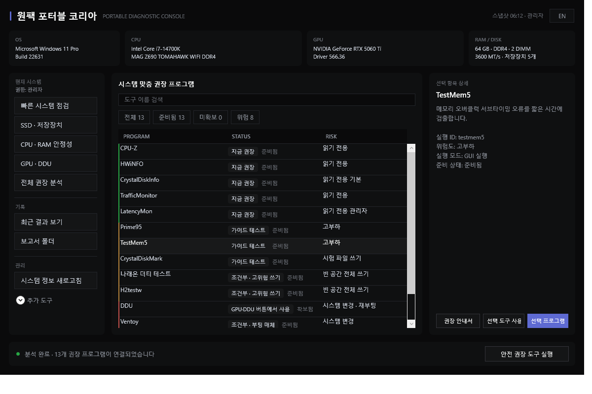
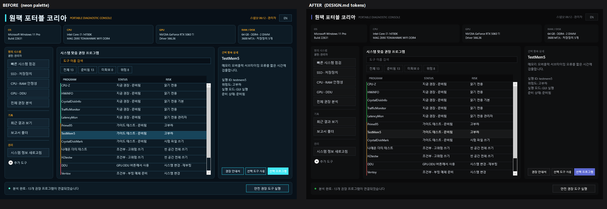

# WinPortableLab

**USB 하나로 끝내는 Windows 11 하드웨어 진단 콘솔. 검증된 34개 도구, 호스트에는 아무것도 설치하지 않습니다.**

**A portable Windows 11 hardware diagnostics console. One USB stick, 34 verified tools, zero installers on the host.**

[](https://github.com/JunesuChoi/win-portable-lab/actions/workflows/ci.yml)
[](LICENSE)
[](#cross-runtime-guarantee--듀얼-런타임-보장)
[](#bilingual-by-contract--이중-언어-계약)

> 드라이브를 꽂고 파일 하나만 실행하면, 눈앞의 장비에 무엇이 문제인지와 그 질문에 답할 도구가 무엇인지 알려줍니다. 스스로를 설치하지 않고, BIOS 값을 바꾸지 않으며, 요청하지 않은 스트레스 테스트를 시작하지 않습니다.
>
> Plug in the drive, run one file, and the console tells you what is wrong with the machine in front of you and which tool answers that question. It never installs itself, never changes a BIOS value, and never starts a stress test you did not ask for.



---

## 🎯 Why this exists / 왜 만들었나

현장 점검은 보통 낡은 실행 파일 30개가 뒤섞인 폴더 하나와, 한 기술자의 머릿속에만 있는 점검 순서에 의존합니다. 이 프로젝트는 그 방식을 **감사할 수 있는 형태**로 바꿉니다.

모든 도구에는 고정된 SHA-256, 선언된 위험 등급, 기록된 실행 모드, 그리고 두 언어로 작성된 안내서가 있습니다. 콘솔은 실제 하드웨어를 읽고 그 하드웨어에 맞는 도구만 권장합니다. 인텔 장비에는 ZenTimings가 뜨지 않고, 데스크톱에는 배터리 항목이 나오지 않으며, 미니덤프가 없는 시스템에는 BlueScreenView를 권하지 않습니다.

Field diagnostics usually means a folder of 30 random executables, half of them outdated, none of them verified, and a mental checklist that lives in one technician's head. This project replaces that with something **auditable**.

Every tool has a pinned SHA-256, a declared risk level, a recorded launch mode, and a written guide in two languages. The console reads the actual hardware, then recommends only the tools that make sense for it. An Intel box never sees ZenTimings. A desktop never sees the battery report. A machine with no minidumps never sees BlueScreenView.

---

## ⚡ What makes it different / 차별점

### 1. 위험도는 경고문이 아니라 타입입니다 · Risk is a first-class type, not a README warning

45개 런처가 각자 위험 등급을 선언합니다. 22개는 읽기 전용이라 즉시 실행되고, 나머지 23개는 데이터를 쓰거나 발열을 만들거나 드라이버를 바꾸므로 **모두 명시적 승인**을 요구합니다. 파괴적 도구는 프로필 게이트 뒤에 남으며, 그 게이트는 선의가 아니라 회귀 테스트가 지킵니다.

Each of the 45 launchers declares a risk tier. 22 are read-only and launch immediately. The other 23 write data, generate heat, or change drivers, and every one of them requires **explicit acknowledgement**. Destructive tools stay behind a profile gate, and the gate is enforced by a regression test rather than by good intentions.

### 2. 해시 고정이 실제로 빌드를 실패시킵니다 · Hash pinning that actually fails the build

저장소 검증은 64자 SHA-256이 없는 패키지 정의를 거부합니다. 다운로더는 압축 해제 전에 고정 해시를 비교하고 불일치 시 중단합니다. 서드파티 바이너리는 커밋되지 않고 정의만 들어갑니다.

Repository validation rejects any package definition without a valid 64-character SHA-256. The downloader compares the pinned hash before extraction and aborts on mismatch. Third-party binaries are never committed; only the definitions are.

### 3. 런처 메뉴가 아니라 추천 엔진입니다 · A recommendation engine, not a launcher menu

콘솔은 인벤토리를 수집하고 최근 7일의 WHEA·Kernel-Power 이벤트와 대조한 뒤 장비별 계획을 만듭니다. 이미 하드웨어 오류가 보이는 시스템이라면 고부하·쓰기·튜닝 계열 항목에 경고 문구를 붙여 알려주되, 실행 여부는 사용자 판단에 맡깁니다.

The console collects inventory, correlates it with a 7-day WHEA and Kernel-Power window, then builds a per-machine plan. If the system already shows hardware errors, it flags high-load, write, and tuning checks with a visible warning instead of hiding or blocking them.

### 4. 남에게 넘길 수 있는 증거 · Evidence you can hand to someone else

실행마다 `reports/` 아래에 JSON, CSV, HTML 번들을 남기고, `applyAllowed: false`로 표시된 기계 판독용 권장 계획을 함께 씁니다. 어디에도 업로드하지 않습니다.

Every run writes JSON, CSV and HTML bundles under `reports/`, plus a machine-readable recommendation plan marked `applyAllowed: false`. Nothing is uploaded anywhere.

---

## 🚀 Quick start / 시작하기

```powershell
git clone https://github.com/JunesuChoi/win-portable-lab.git
cd win-portable-lab
.\Start.cmd
```

이게 전부입니다. 대시보드가 열리고 하드웨어 요약을 즉시 보여준 뒤, 권장 분석은 백그라운드에서 끝냅니다.

That is it. The dashboard opens, shows a hardware summary immediately, and finishes the recommendation scan in the background.

도구는 필요할 때 받습니다 · Tools download on demand:

```powershell
.\scripts\Install-PortableTools.ps1 -Root . -Id hwinfo,cpuz,crystaldiskinfo
.\WinPortableLab.ps1 -Action check -Profile all -Language ko
```

### npm으로 전역 설치 · Install globally via npm

Node.js가 있다면 clone 없이 전역 설치 후 어디서든 `wpl` 한 글자로 실행할 수 있습니다.

If you have Node.js, install globally and run it from anywhere with a single command.

```powershell
npm install -g @jstrsy08/win-portable-lab
wpl
```

`wpl`은 `WinPortableLab.ps1`과 같은 인자를 그대로 받습니다. (`wpl -Action list`, `wpl -Action check -Profile quick` 등)

`wpl` accepts the same arguments as `WinPortableLab.ps1` (`wpl -Action list`, `wpl -Action check -Profile quick`, and so on).

### 프로젝트 업데이트 · Update the project

GUI의 **프로젝트 업데이트 / Update project** 버튼은 공식 GitHub `main` 커밋을 확인합니다. 새 버전은 확인창을 거쳐 적용하며, 앱이 닫힌 뒤 자동으로 다시 시작합니다. 코드·문서·카탈로그만 `logs\self-update-backup-<timestamp>`에 백업 후 바뀝니다. 도구 바이너리, 다운로드, 보고서, 세션, `config\user-tool-paths.json`은 그대로 보존합니다.

The **Update project / 프로젝트 업데이트** button checks the official GitHub `main` commit. After confirmation, it applies the update once the app closes and restarts automatically. Only code, documentation, and catalog files change after a backup in `logs\self-update-backup-<timestamp>`; tools, downloads, reports, sessions, and `config\user-tool-paths.json` remain untouched.

For a command-line check:

```powershell
.\scripts\Update-WplSelf.ps1 -Root . -Action check
```

레지스트리에 올리기 전이라면 깃허브에서 바로 설치할 수도 있습니다.

Before the registry release, you can also install straight from GitHub.

```powershell
npm install -g github:JunesuChoi/win-portable-lab
```

관리자 권한이 필요한 작업은 실행 중 UAC 확인창으로 승격됩니다.

Tasks that require admin rights elevate themselves through a UAC prompt at launch.

---

## 📦 The catalog / 도구 카탈로그

용도가 이름에 드러나는 9개 폴더에 34개 도구가 있습니다. 폴더 이름만 봐도 그 도구를 어디에 쓰는지 알 수 있습니다.

34 tools across 9 purpose-named folders, so the layout tells you what a tool is for before you open it.

| 폴더 / Folder | 영역 / Covers | 주요 도구 / Notable |
|---|---|---|
| `01-System-Info-Monitoring` | 센서·식별·냉각·배터리<br>Sensors, identification, cooling, battery | HWiNFO, CPU-Z, GPU-Z, BatteryInfoView |
| `02-Storage-Health-SMART` | SMART·수명<br>SMART and endurance | CrystalDiskInfo, smartmontools |
| `03-Storage-Benchmark-Dirty-Integrity` | 벤치마크·지속 쓰기·무결성<br>Benchmark, sustained write, integrity | Naraeon Dirty Test, H2testw, WizTree |
| `04-CPU-Memory-Stability` | 부하·메모리 검증<br>Load and memory validation | Prime95, TestMem5, HCI MemTest, OCCT |
| `05-GPU-Driver-Cleanup` | 드라이버 제거<br>Driver removal | DDU, AMD Cleanup, DriverStore Explorer |
| `06-CPU-Tuning-Installers` | 제조사 튜닝<br>Vendor tuning | Intel XTU (양 세대), Ryzen Master |
| `07-System-Driver-Diagnostics` | 크래시·지연·프로세스 추적<br>Crash, latency, process tracing | LatencyMon, Sysinternals, BlueScreenView |
| `08-Network-Traffic-Monitoring` | 대역폭·자원 감시<br>Throughput and resource watch | TrafficMonitor |
| `09-Driver-Detection-Maintenance` | 드라이버 감지·유지관리<br>Driver detection, maintenance | SDIO, Glary Utilities |

고정 해시가 포함된 전체 표 · Full table with pinned hashes: [installed tool snapshot](docs/tooling/INSTALLED_TOOLS.md)

---

## 🌏 Bilingual by contract / 이중 언어 계약

사용자에게 보이는 모든 문자열은 한국어와 영어로 존재하며, 한쪽이 빠지면 **테스트가 실패**합니다. 13개 도구별 안내서도 KO/EN 양쪽 존재와 실제 파일 참조가 검증됩니다.

Every operator-facing string exists in Korean and English, and a **test fails** if a localization key is missing either side. The same applies to the 13 per-tool guides: KO and EN are checked for existence and for pointing at real files.

안내서는 링크 모음이 아닙니다. [TESTMEM5.md](docs/ko/tools/TESTMEM5.md)는 anta777 프로필 8종을 비교하고, `Load config & exit` 후 재실행하지 않으면 이전 프로필로 검사되는 함정을 문서화하며, 백신 오탐 경고를 담습니다. [OCCT.md](docs/ko/tools/OCCT.md)는 자체 온도 임계값이 무인 실행 중 유일한 안전장치인 이유를 설명합니다.

The guides are not link dumps. [TESTMEM5.md](docs/en/tools/TESTMEM5.md) compares all eight anta777 profiles, documents the `Load config & exit` restart trap that silently tests the previous profile, and warns that antivirus heuristics flag it. [OCCT.md](docs/en/tools/OCCT.md) explains why its built-in temperature ceiling is the only safeguard during an unattended run.

---

## 🔁 Cross-runtime guarantee / 듀얼 런타임 보장

Windows PowerShell 5.1과 PowerShell 7은 데이터를 조용히 망가뜨리는 방식으로 다르게 동작합니다. 5.1의 `ConvertFrom-Json`은 최상위 JSON 배열을 단일 중첩 객체로 반환하는데, 이 때문에 45행 런처 감사가 의미 없는 1행으로 뭉뚱그려졌고 회귀 테스트가 잡아내기 전까지 드러나지 않았습니다.

Windows PowerShell 5.1 and PowerShell 7 behave differently in ways that quietly corrupt data. `ConvertFrom-Json` on 5.1 returns a top-level JSON array as a single nested object, which silently collapsed a 45-row launcher audit into one meaningless row until a regression test caught it.

그래서 매번 두 호스트 모두에서 실행합니다 · So the suite runs on both hosts, every time:

```powershell
.\scripts\Test-Regression.ps1 -Root .
```

테스트 60개를 두 런타임에서, Pester 3.4와 Pester 6으로 모두 실행합니다. 검증 대상은 실제로 중요한 동작입니다. 색 리터럴이 디자인 토큰 블록을 벗어나지 않는지, 발견 전용 행이 실행 불가로 유지되는지, 목록 필터가 실제 행을 걸러내는지, 고부하 도구가 온도 감시 승인 없이는 시작되지 않는지, 부트스트랩이 먼저 끝난 뒤 남은 작업 프로세스까지 추적되는지입니다.

60 tests, both runtimes, both Pester 3.4 and Pester 6. The tests assert behaviour that matters: that colour literals never escape the design token block, that discovery-only rows stay unlaunchable, that each list filter actually removes rows, that a high-load tool refuses to start without a temperature-monitoring acknowledgement, and that a worker surviving its exited bootstrap is still tracked and stopped.

---

## 🎨 Design / 디자인

인터페이스는 단일 강조색과 위험 표현용 절제된 의미색 3개로 구성된 계약을 따릅니다. 색은 XAML 리소스 토큰으로 한 번만 선언하며, 다른 곳에 리터럴이 나타나면 테스트가 실패합니다.

The interface uses a single chromatic accent plus three muted semantic colours for risk. Colour is declared once as XAML resource tokens; a test fails if a literal appears anywhere else.



---

## 🛡 Safety model / 안전 모델

| 원칙 / Principle | 내용 |
|---|---|
| 자동 실행 없음<br>Nothing runs automatically | 위험 도구는 GUI 확인 창과 `-AcknowledgeRisk`를 요구합니다<br>Risky tools require confirmation in the GUI and `-AcknowledgeRisk` on the command line |
| 설정 변경 없음<br>No settings applied | BIOS, 전압, 배수, 메모리 프로필, 팬 곡선을 적용하지 않습니다. 권장 출력은 `applyAllowed: false`<br>No BIOS, voltage, ratio, memory profile or fan curve is ever applied |
| 원시 쓰기 금지<br>No raw writes | 저장장치 벤치마크는 제한된 파일만 대상으로 합니다<br>Storage benchmarks target bounded files only |
| 비밀 수집 없음<br>No secrets collected | TPM·BitLocker는 *상태*만 읽고 복구 키는 읽지 않습니다<br>Reads TPM and BitLocker *status*, never recovery keys |
| 증거 보존<br>Evidence preserved | 정리 도구는 읽기 전용 점검으로 제한됩니다. 이벤트 로그와 미니덤프 삭제는 진단 근거를 파괴합니다<br>Cleanup utilities are scoped to read-only inspection |

자세한 내용 · Details: [SAFETY_POLICY.md](docs/SAFETY_POLICY.md), [SECURITY.md](SECURITY.md)

---

## 🚫 Non-goals / 하지 않는 것

Windows 설치나 디블로트. 자동 튜닝. 독점적 바이너리를 번들로 묶는 일. 한 번 통과한 테스트로 시스템이 안정적이라고 선언하는 일.

Installing or debloating Windows. Auto-tuning anything. Bundling proprietary binaries. Declaring a system stable from one passing test.

---

## 📚 Documentation / 문서

| 주제 / Topic | 한국어 | English |
|---|---|---|
| 도구 빠른 사용 안내 / Quick tool reference | [QUICK_USE](docs/ko/QUICK_USE.md) | [QUICK_USE](docs/en/QUICK_USE.md) |
| 권장 설정 / Recommended settings | [SETTING_GUIDE](docs/ko/SETTING_GUIDE.md) | [SETTING_GUIDE](docs/en/SETTING_GUIDE.md) |
| SSD 더티 테스트 / SSD dirty test | [SSD_DIRTY_TEST](docs/ko/SSD_DIRTY_TEST.md) | [SSD_DIRTY_TEST](docs/en/SSD_DIRTY_TEST.md) |
| 내 프로그램 경로 등록 / Your own tool paths | [USER_TOOL_PATHS](docs/ko/USER_TOOL_PATHS.md) | [USER_TOOL_PATHS](docs/en/USER_TOOL_PATHS.md) |
| 네트워크 드라이버 백업·원팩 / Network driver backup and one-packs | [NETWORK_DRIVERS](docs/ko/NETWORK_DRIVERS.md) | [NETWORK_DRIVERS](docs/en/NETWORK_DRIVERS.md) |

그 외 · Also: [Architecture](docs/ARCHITECTURE.md), [Tool catalog](docs/tooling/TOOL_CATALOG.md), [Setup guides](docs/tooling/SETUP_GUIDES.md), 플랫폼 가이드 [Intel](docs/guides/CPU_INTEL.md) / [AMD](docs/guides/CPU_AMD.md) / [GPU](docs/guides/GPU_DDU.md) / [RAM](docs/guides/RAM_OVERCLOCK.md)

---

## 📄 Licence / 라이선스

프로젝트의 스크립트, 설정, 문서는 MIT 라이선스입니다([LICENSE](LICENSE)). 서드파티 진단 프로그램은 필요할 때 내려받으며 이 저장소에 커밋되지 않고 각자의 제조사 약관을 따릅니다. 일부는 개인 사용만 무료이므로 상업적 사용 전에 [THIRD_PARTY_NOTICES.md](THIRD_PARTY_NOTICES.md)를 확인하십시오.

Project scripts, configuration and documentation are MIT licensed; see [LICENSE](LICENSE). Third-party diagnostic programs are downloaded on demand, are never committed here, and remain under their own vendor terms. Several are free for personal use only, so read [THIRD_PARTY_NOTICES.md](THIRD_PARTY_NOTICES.md) before commercial use.

---

## 🤝 Contributing / 기여

도구를 추가하려면 카탈로그 항목, 실제 고정 해시가 있는 매니페스트, 위험 등급이 선언된 런처, 그리고 KO/EN 문서가 모두 필요합니다. [CONTRIBUTING.md](CONTRIBUTING.md)에 점검 목록이 있고, 저장소 검증이 무엇이 빠졌는지 알려줍니다.

Adding a tool means adding a catalog entry, a manifest with a real pinned hash, a launcher with a declared risk tier, and KO/EN documentation. [CONTRIBUTING.md](CONTRIBUTING.md) has the checklist. Repository validation will tell you what you missed.
